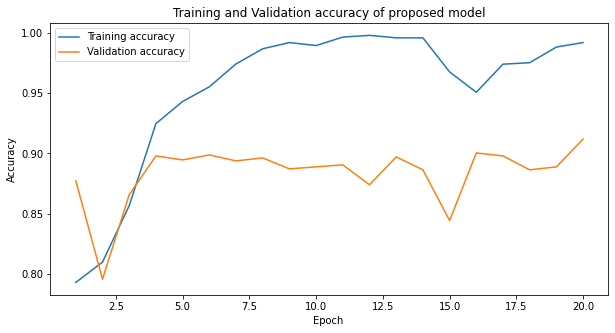
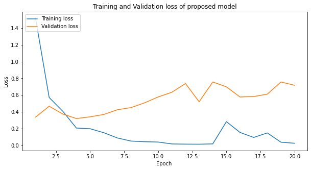
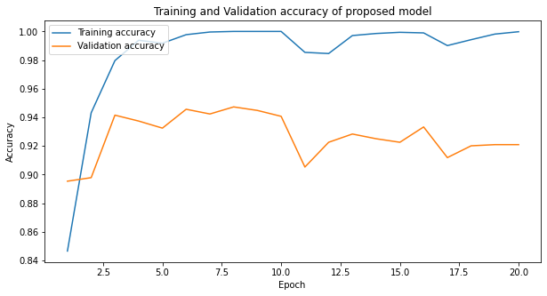
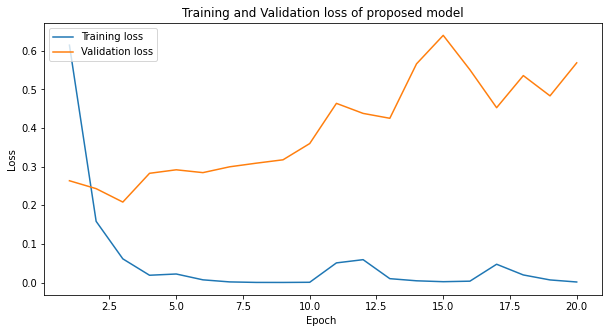
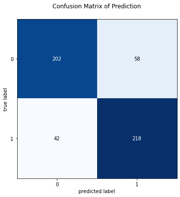
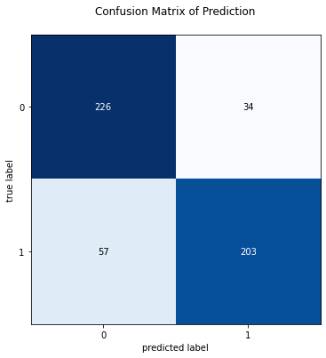

# An Application of Machine Learning Techniques for Covid-19 Diagnosis  

Use CNN Architecture for Build Covid-19 Classification Model from X-ray Images and this project is on going.  

## Data Info
 * Covid data from this Github : [covid](https://github.com/ieee8023/covid-chestxray-dataset)
 * Normal data from this Kaggle : [normal](https://www.kaggle.com/paultimothymooney/chest-xray-pneumonia)  
 
 Covid data have 930 images but can use only 867 images when compare with metadata  
 Normal data have 1341 images, I use only normal case in Pneumonia Data set.  

## Data Pre-processing
 
 First, I random choice images of normal to 867 images for avoid imbalance class and split train test 70:30  
 and use pickle for save images data to pickle files, it can save images data and didn't change it when load again.  
 | Dataset   | Covid-19 | Normal | Total |
 | --------  | -------- | ------ | ----- |
 | Training  |    607   |  607   |  1214 |
 | Testing   |    260   |  260   |  520  |
 | Total     |    867   |  867   |  1734 |
 
  After I already complete with training and testing data, I follow these processes before building model.  

 * Image Augmentation
 Augmentation with rotate, crop and filp images and get new data set in this table.  
 
 | Dataset   | Covid-19 | Normal | Total |
 | --------  | -------- | ------ | ----- |
 | Training  |    3035  |  3035  |  6070 |
 | Testing   |    260   |  260   |  520  |
 | Total     |    3295  |  3295  |  6590 |
 
 * Image Enhancement  
 I assumed histogram equalization will help a little bit then I try to use it.
   
 * Image resizing  
 In this project, I resize it into 400*400 because images in data set have various size.
 
 * Normalization  
 I try to use data/ 255.0 in this project.

## Building Model
Building with CNN Architecture 20 epochs, batch size = 16 and use validation split = 0.2
Model 1 fit with Augmentation data  
Model 2 fit with Augmentation&Enhancement data  

Model 1 train and loss when training  

Model 2 train and loss when training  

Then I got average accuracy and loss of 2 models from 20 epochs here  

Model 1 : average accuracy training : 95.28% and average loss training  : 0.2034  
&nbsp; &nbsp; &nbsp; &nbsp;: average accuracy validation : 88.36% and average loss validation  : 0.5373  

Model 2 : average accuracy training : 98.49% and average loss training  : 0.0545  
&nbsp; &nbsp; &nbsp; &nbsp;: average accuracy validation : 92.68% and average loss validation  : 0.3991  		

Evaluate Model with testing data  
Model 1 got accuracy : 80.769%  and loss : 483.665  
Model 1 got accuracy : 82.499%  and loss : 163.642  

##Prediction Model
Now use testing data for predict Covid-19  
Class 0 : Normal, Class 1 : Covid-19  

Model 1 Confusion Matrix  
  

Model 2 Confusion Matrix  
  

Here is Classification Report of 2 models
 |  Model  | Accuracy | Recall  | Precision | F1-Score |
 | ------- | -------- | ------- | --------- | -------- |
 | Model 1 |  80.7692 | 83.8461 |  78.9855  | 81.3432  |
 | Model 2 |   82.5   | 78.0769 |  85.654   | 81.6901  |
 
## Summary
Now, I think Model 2 is better than Model 1 in overall.
